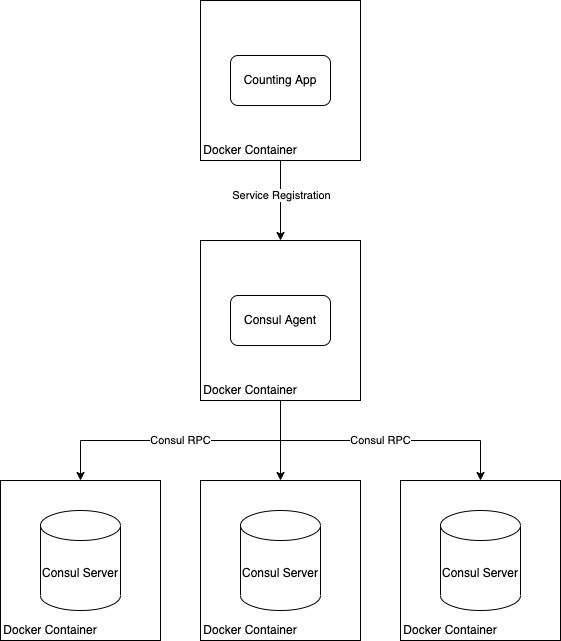

# Configure a multi-node Consul on Docker containers for service discovery and KV storage

### Motivation

Hashicorp Consul is a tool that does many things from service discovery to DNS resolution to providing a distributed KV store. This is especially useful for environments where there are many microservices that can be registered against Consul and thus remove the need to track and maintain multiple API endpoints for each service. With Consul service discovery they can all be managed via Consul DNS.

With Docker containers we can speed up the process of deploying and testing many microservices by setting up a Consul cluster. We can interact with the cluster using another Docker container running a Consul agent.

In this tutorial we first go through how to deploy Consul on docker containers with some custom configuration and get the cluster up and running. Then we register a micro-service on it to demonstrate service discovery. Because we are setting up a multi-node Consul cluster and Consul itself is fairly lightweight we will use docker containers to deploy the whole setup and use container volumes to mount the config files.

### Intended Learning Outcomes
- Concepts of Docker
- How to use docker volumes
- How to exec into running containers
- Consul concepts and setting up a cluster using docker containers
- Interacting with the Consul KV store
- Registering a microservice on Consul

### Architecture

For our tutorial we setup a Consul cluster of three servers. We also have a Consul agent running in another Docker container. We register a small counting application on the agent and expose it via the Consul DNS.

